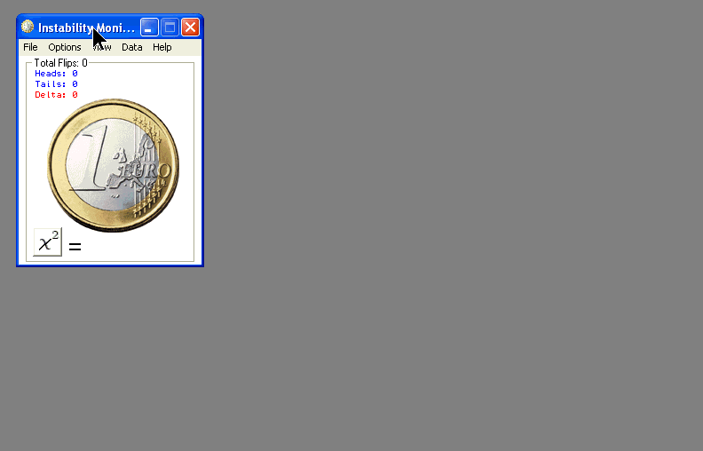



## True \(not pseudo\) Random Coin Toss

### Description

As you know, computers generate a pseudo set of random numbers. This is unavoidable in a digital environment. A coin toss is in reality an analog event. The only way to have a truly random number generator is by introducing an analog to digital conversion. This program does exactly that. The analog random event sampled is sound frequency and by using a microphone, a completely random set of numbers (seeds) are generated. The audio FFT is borrowed from PSC. Many methods have been suggested to perform this task. Some have used random data sets as seeds. Others have sampled mouse movement. A website provides realtime random atmospheric data (www.random.org). There has even been a proposal to include a cesium chip in all computers eventually as it decays in a random fashion. My method seems foolproof as long as a microphone is set at a reasonable sensitivity and the environment is noisey. The importance of true randomization cannot be overemphasized as this is essential for the scientific method and in clinical studies. My application, which will be posted soon, is simpler and more abstruse. I intend to use this random generator to identify variations in our collective unconscious, an idea I heard about on National Geographic. ---Update(08-22-07):Instability added, minor changes ---Update (08-25-07): Algorithm improved, Added Temporal Instability monitor with raw data, Chi Squared Statistic with table to assess randomness. You may compare a Simulation (using the Timer seed) versus my Hardware (sound) Seed, although significant difference will require over about 1 million flips. The instability data may be viewed in 15 minute intervals for about 1 year using MSChart32. Rudimentary help file with more to follow.
 
### More Info
 

             |
---                |---
**Submitted On**   |2007-08-25 13:55:46
**By**             |[Warren Goff](https://github.com/Planet-Source-Code/PSCIndex/blob/master/ByAuthor/warren-goff.md)
**Level**          |Beginner
**User Rating**    |5.0 (15 globes from 3 users)
**Compatibility**  |VB 6\.0
**Category**       |[Math/ Dates](https://github.com/Planet-Source-Code/PSCIndex/blob/master/ByCategory/math-dates__1-37.md)
**World**          |[Visual Basic](https://github.com/Planet-Source-Code/PSCIndex/blob/master/ByWorld/visual-basic.md)
**Archive File**   |[True\_\(not\_2080698252007\.zip](https://github.com/Planet-Source-Code/warren-goff-true-not-pseudo-random-coin-toss__1-69188/archive/master.zip)

